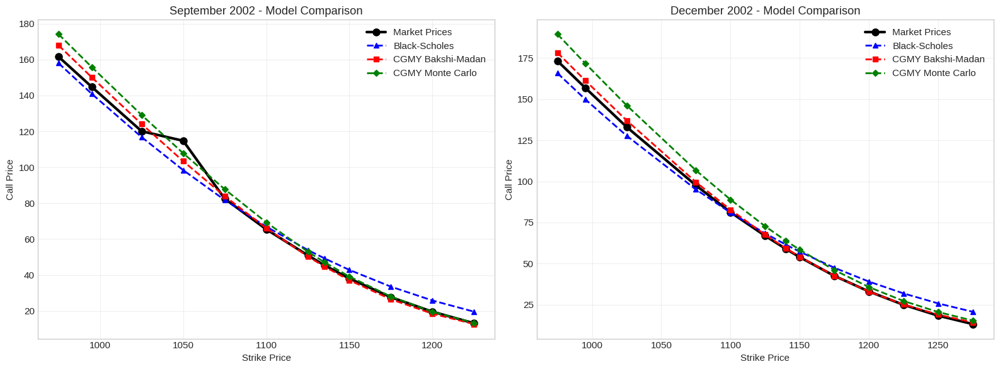

# Option Pricing with CGMY Lévy Processes 📉✨

This repository implements a quantitative framework for pricing S&P 500 (SPX) index options from September and December 2002 using the **CGMY Model** (a four-parameter Lévy process). Developed for the **Lévy Processes and Applications** course in the **MSc in Mathematical Finance at ISEG**.

The CGMY model (named after Carr, Geman, Madan, and Yor) is a powerful generalization of the Variance Gamma process, capable of capturing both **infinite activity** and **infinite variation**, effectively modeling the heavy tails and "volatility smiles" observed in real market data.

---

## 🛠️ Personal Contribution & Methodology (Part 2: i & iii)

My core responsibility in this project was the implementation of the analytical pricing framework and the empirical validation against market benchmarks.

### 1. Closed-Form Analytical Pricing (Bakshi-Madan Approach)
Since Lévy processes are defined by their **Characteristic Function ($\Phi$)** rather than a probability density function, I implemented the pricing logic using the **Bakshi-Madan (1997)** formula, adapted for a non-zero dividend yield ($q$):

$$C(K,T) = S_0 e^{-qT} \Pi_1 - K e^{-rT} \Pi_2$$

#### The Role of Characteristic Functions
The terms $\Pi_1$ and $\Pi_2$ represent the risk-neutral probabilities of the option finishing in-the-money. These are obtained by inverting the CGMY characteristic function using the Gil-Pelaez inversion theorem:

$$\Pi_j = \frac{1}{2} + \frac{1}{\pi} \int_0^\infty \text{Re} \left[ \frac{e^{-iu \ln(K)} \Phi_j(u, T)}{iu} \right] du$$

* **$\Phi_2(u, T)$:** The standard characteristic function of the log-price process under CGMY.
* **$\Phi_1(u, T)$:** The "shifted" characteristic function, defined as $\Phi_1(u) = \frac{\Phi_2(u-i)}{\Phi_2(-i)}$, which uses the stock price as the numeraire (measure change).

### 2. Model Comparison & Numerical Validation
I conducted a rigorous comparison across four different pricing paradigms to evaluate the CGMY model's performance and ensure numerical consistency:

* **CGMY Analytical Model:** Prices obtained via the Bakshi-Madan formula and Gil-Pelaez inversion of the characteristic function.
* **Monte Carlo Simulation:** Implemented a numerical simulator for the CGMY process to validate the analytical results. This involved simulating the underlying Lévy paths and computing the expected payoff under the risk-neutral measure.
* **Black-Scholes Model:** Used as a baseline to highlight the limitations of constant volatility and the absence of jumps in traditional models.
* **Market Prices (SPX):** Real-world benchmarks used to evaluate the model's calibration to the empirical volatility smile.

---

## 📈 Key Insights & Results

* **Numerical Consistency:** The Monte Carlo results converged successfully to the analytical Bakshi-Madan prices, validating the high-precision integration of the characteristic function.
* **Volatility Smile Fitting:** The CGMY model significantly outperformed Black-Scholes in fitting Out-of-the-Money (OTM) options, accurately capturing the market's tail-risk expectations.
* **Dividend Yield Impact:** Successful integration of $q$ into the Fourier inversion, ensuring the model is applicable to major equity indices like the SPX.

*Figure: CGMY Bakshi-Madan vs CGMY Monte Carlo vs Black-Scholes vs Market Prices for SPX Options.*

---

## 💻 Tech Stack

* **Python:** Core numerical implementation.
* **SciPy & NumPy:** Complex number handling and numerical integration (`quad`).
* **Matplotlib:** Financial visualization and error analysis.
* **LaTeX:** For mathematical documentation and reporting.

---

## 📂 Project Structure

* `CGMY_Code.ipynb`: Full implementation of characteristic functions, Bakshi-Madan formula, and calibration logic.
* `Project_Guidelines.pdf`: Detailed assignment requirements.
* `visualizations/`: Plots showing the CGMY Bakshi-Madan fit vs. Black-Scholes vs. Market.

---
**Authors:** [Petr Terletskiy](https://www.linkedin.com/in/petr-terletskiy/) (Analytical Pricing & Market Analysis), António Mendonça, Julians Mošenko-Galuzo, Thomas Nava, Tiago Monteiro.  
**Context:** Master's in Mathematical Finance (ISEG - 2025/26)
